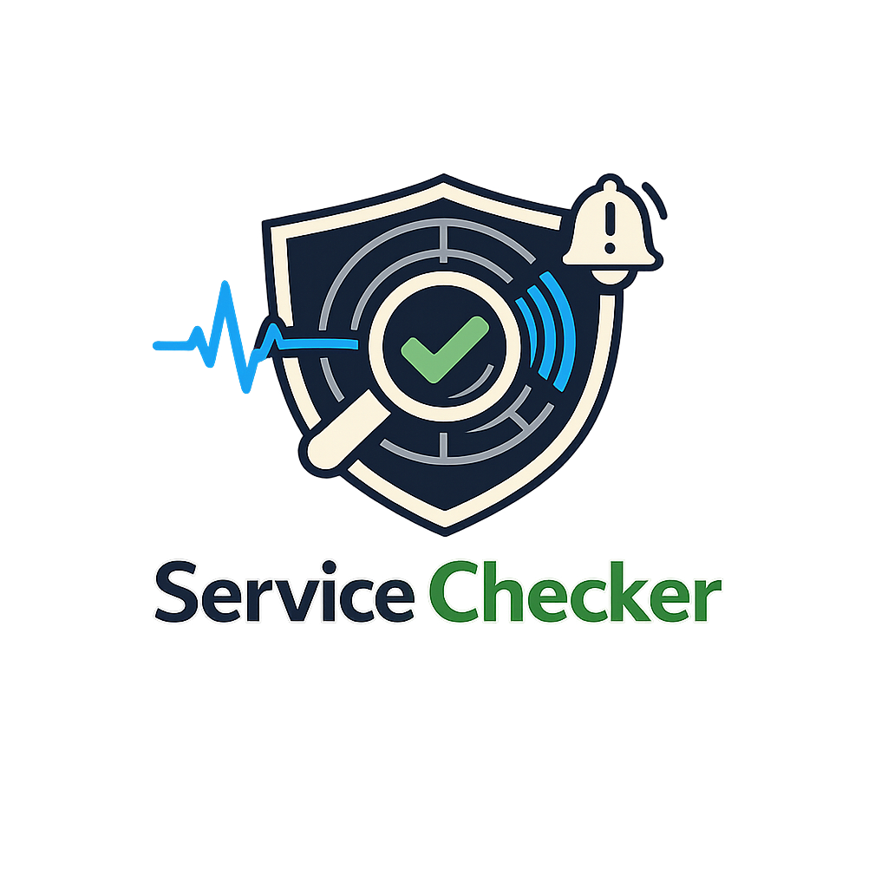

<p align="center">
  
</p>

# ⚙️ Service Monitor


[](https://www.paypal.com/donate/?business=ZUADM4SZT5DC8&no_recurring=0&item_name=Projetos+desenvolvidos+com+cuidado+e+dedica%C3%A7%C3%A3o.+O+apoio+incentiva+a+continuidade+e+a+evolu%C3%A7%C3%A3o+constante.&currency_code=BRL)

🔗 Nav: [🎮 Steam](app/modules/steam/README.md) · [🤖 OpenAI](app/modules/openai/README.md) · [🟣 Claude](app/modules/claude/README.md) · [🧭 Cfx](app/modules/cfx/README.md) · [☁️ OCI](app/modules/oci/README.md) · [🌐 GCP](app/modules/gcp/README.md) · [☁️ AWS](app/modules/aws/README.md) · [🔔 Notifications](app/notifications/README.md) · [🐳 Docker](DOCKER.md)

A modular Python monitor that continuously checks third-party status pages (Steam, OpenAI, Claude, Cfx, OCI, GCP, and AWS) and sends configurable alerts when any module detects an incident.

## ✅ Highlights
- Modular, plug-in style monitors for popular status providers.
- Multiple notification channels (Telegram, Webhook).
- Per-service alert lifecycle with repeat throttling.
- Docker-first deployment with sensible defaults.

## 🎯 Why this exists
- Reduce manual status page checks across multiple providers.
- Standardize alerting for incidents across heterogeneous sources.
- Keep the footprint small and operable with simple env config.

## 🧭 Use cases
- Ops teams wanting a single alert stream for upstream incidents.
- SREs watching provider health in specific regions or services.
- Personal or small-team monitoring without heavy tooling.

## 🧱 Project structure
- `app/`: core engine, module loaders, modules, and notifiers ([notifications](app/notifications/README.md)).
- `docker-compose.yml`, `Dockerfile`, and `.env(.example)`: local and container runtime ([Docker guide](DOCKER.md)).

## 📦 Modules
Each module pulls a provider-specific status source and applies rules configured via environment variables.

- 🎮 **Steam**: https://steamstat.us/ (HTML parsing with status/keyword/regex). [📖](app/modules/steam/README.md)
- 🤖 **OpenAI**: https://status.openai.com (`/api/v2/summary.json`). [📖](app/modules/openai/README.md)
- 🟣 **Claude**: https://status.claude.com (`/api/v2/summary.json`). [📖](app/modules/claude/README.md)
- 🧭 **Cfx**: https://status.cfx.re (`/api/v2/summary.json`). [📖](app/modules/cfx/README.md)
- ☁️ **OCI**: https://ocistatus.oraclecloud.com (RSS `incident-summary.rss`). [📖](app/modules/oci/README.md)
- 🌐 **GCP**: https://status.cloud.google.com (`incidents.json`). [📖](app/modules/gcp/README.md)
- ☁️ **AWS**: https://health.aws.amazon.com/public/currentevents (JSON events). [📖](app/modules/aws/README.md)

See each module README for rules, filters, and examples.

## 🔔 Notifications
Alerts are managed by `NotificationManager` and dispatched when a module reports `ALERT` or when a service returns to `OK`.

- **Telegram**: HTML card notifications for chats or groups. [Telegram notifier](app/notifications/telegram/README.md)
- **Webhook**: JSON POST payloads for custom integrations. [Webhook notifier](app/notifications/webhook/README.md)

## 🚀 Quick start
1. Copy `.env.example` to `.env` and customize filters/tokens.
2. Run `docker compose up --build` from the repository root.
3. Monitor logs with `docker compose logs --tail 20`.

## 🗺️ Flow overview
```
Providers -> Modules -> Monitor Core -> NotificationManager -> Channels
```

## 🧰 Configuration essentials
- `SERVICE_MONITOR_MODULES`: comma-separated list of module slugs to load.
- `NOTIFICATION_REPEAT_MINUTES`: minimum interval to repeat alerts for the same service.
- `TELEGRAM_ENABLED` / `WEBHOOK_ENABLED`: enable channels.

Each module also supports its own `*_RULE_KIND`, `*_RULE_VALUE`, and `*_SERVICE_FILTER` keys.

## 🐳 Docker usage
See [DOCKER.md](DOCKER.md) for GHCR image usage, dev builds (`docker-compose-dev.yml`), and full environment reference.

## 🧯 Troubleshooting
- **No alerts coming through**: verify the module is enabled, `*_RULE_KIND`/`*_RULE_VALUE` are set, and the provider is actually degraded.
- **Telegram messages not delivered**: check bot token, chat ID, and whether the bot has been added to the group.
- **Webhook errors**: confirm the endpoint is reachable and accepts JSON, and validate any auth header settings.
- **Too many alerts**: increase `NOTIFICATION_REPEAT_MINUTES` or narrow `*_SERVICE_FILTER`.

## 🔗 Documentation
- Modules: [Steam](app/modules/steam/README.md), [OpenAI](app/modules/openai/README.md), [Claude](app/modules/claude/README.md), [Cfx](app/modules/cfx/README.md), [OCI](app/modules/oci/README.md), [GCP](app/modules/gcp/README.md), [AWS](app/modules/aws/README.md)
- Notifications: [Overview](app/notifications/README.md) · [Telegram](app/notifications/telegram/README.md) · [Webhook](app/notifications/webhook/README.md)
- Infra: [DOCKER.md](DOCKER.md), [docker-compose.yml](docker-compose.yml)

## 💖 Support the Project

If you find this project useful, consider supporting its development:

[](https://www.paypal.com/donate/?business=ZUADM4SZT5DC8&no_recurring=0&item_name=Projetos+desenvolvidos+com+cuidado+e+dedica%C3%A7%C3%A3o.+O+apoio+incentiva+a+continuidade+e+a+evolu%C3%A7%C3%A3o+constante.&currency_code=BRL)

Your donation helps with:
- 🚀 New features and improvements
- 🐛 Bug fixes and maintenance
- 📖 Documentation updates
- ☕ Developer sustainability
